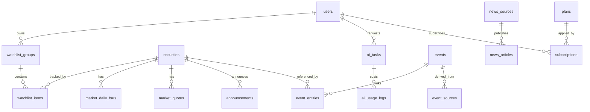

# Trading Studio 数据库详细设计

## 1. 设计目标

- 支撑“股票主数据 + 行情 + 新闻公告 + 事件 + AI + 会员”核心业务
- 保证关键对象可追溯、可审计、可扩展
- 兼顾 Laravel 业务事务与 FastAPI 数据处理的协同
- 为后续搜索、向量检索、数据回补和商业化配额留出空间

## 2. 设计原则

### 2.1 标准标识优先

股票使用统一标识 `canonical_symbol`，格式推荐：

```text
CN.XSHE.000001
CN.XSHG.600000
CN.BJSE.430047
```

### 2.2 原始数据与业务数据分层

- 原始载荷存对象存储或 Raw 表，不直接驱动前台
- 业务表只保存标准化结果和关键追踪字段

### 2.3 事件是核心中台对象

- 新闻与公告是来源
- 事件是结构化事实
- AI 输出需要引用新闻、公告、事件和行情数据

### 2.4 所有关键链路可追溯

关键表必须尽量保留：

- `provider`
- `source_item_id`
- `fetched_at`
- `source_timestamp`
- `parser_version`
- `created_at`
- `updated_at`

## 3. 逻辑分域

| 领域 | 关键表 |
| --- | --- |
| 用户与权限 | `users`、`user_profiles`、`user_settings`、`roles`、`permissions`、`workspaces` |
| 证券与市场 | `securities`、`security_aliases`、`sectors`、`sector_members`、`market_quotes`、`market_daily_bars` |
| 新闻与公告 | `news_sources`、`news_articles`、`news_article_contents`、`announcements`、`announcement_contents` |
| 事件 | `event_types`、`events`、`event_entities`、`event_sources`、`event_market_impacts` |
| 自选股与研究 | `watchlist_groups`、`watchlist_items`、`favorites`、`research_notes` |
| AI | `ai_conversations`、`ai_messages`、`ai_tasks`、`ai_prompt_templates`、`ai_model_configs`、`ai_usage_logs` |
| 会员与订单 | `plans`、`subscriptions`、`orders`、`payments`、`user_quotas` |
| 系统 | `data_jobs`、`data_job_runs`、`provider_health_logs`、`notifications`、`audit_logs` |

## 4. 关键关系图



## 5. 关键枚举建议

### 5.1 通用状态

- `active`
- `inactive`
- `disabled`
- `archived`

### 5.2 事件状态

- `detected`
- `processing`
- `verified`
- `published`
- `merged`
- `rejected`
- `expired`
- `corrected`

### 5.3 AI 任务状态

- `pending`
- `running`
- `succeeded`
- `failed`
- `cancelled`
- `timed_out`

### 5.4 重要性等级

- `S`
- `A`
- `B`
- `C`
- `D`

## 6. 表清单与职责

### 6.1 用户与权限

| 表名 | 职责 |
| --- | --- |
| `users` | 账号主表 |
| `user_profiles` | 用户昵称、头像、职业、风险偏好 |
| `user_settings` | 通知偏好、时区、语言、隐私设置 |
| `user_login_logs` | 登录行为审计 |
| `workspaces` | 专业版工作区 |
| `workspace_members` | 工作区成员与角色 |

### 6.2 证券与市场

| 表名 | 职责 |
| --- | --- |
| `securities` | 股票主档案 |
| `security_aliases` | 股票别名、历史简称、拼音 |
| `sectors` | 行业和概念板块 |
| `sector_members` | 股票与板块关系 |
| `market_quotes` | 实时或准实时快照 |
| `market_daily_bars` | 日线行情 |
| `financial_indicators` | 财务指标 |
| `money_flows` | 资金流 |

### 6.3 内容与事件

| 表名 | 职责 |
| --- | --- |
| `news_sources` | 新闻源配置 |
| `news_articles` | 新闻头信息 |
| `news_article_contents` | 清洗后正文与结构化摘要 |
| `announcements` | 公告头信息 |
| `announcement_contents` | 公告正文与解析结果 |
| `events` | 结构化事件主表 |
| `event_entities` | 事件和股票/板块/公司关联 |
| `event_sources` | 事件来源映射 |
| `event_market_impacts` | 事件前后收益和市场反应 |

## 7. 关键表 DDL

### 7.1 `users`

```sql
CREATE TABLE users (
    id BIGINT UNSIGNED PRIMARY KEY AUTO_INCREMENT,
    name VARCHAR(128) NOT NULL,
    email VARCHAR(191) NULL UNIQUE,
    mobile VARCHAR(32) NULL UNIQUE,
    password VARCHAR(255) NOT NULL,
    status VARCHAR(32) NOT NULL DEFAULT 'active',
    membership_level VARCHAR(32) NOT NULL DEFAULT 'free',
    last_login_at DATETIME NULL,
    last_login_ip VARCHAR(64) NULL,
    created_at TIMESTAMP NULL,
    updated_at TIMESTAMP NULL,
    INDEX idx_status_level (status, membership_level)
);
```

### 7.2 `workspaces`

```sql
CREATE TABLE workspaces (
    id BIGINT UNSIGNED PRIMARY KEY AUTO_INCREMENT,
    owner_id BIGINT UNSIGNED NOT NULL,
    name VARCHAR(128) NOT NULL,
    slug VARCHAR(128) NOT NULL UNIQUE,
    plan_code VARCHAR(64) NOT NULL DEFAULT 'pro',
    status VARCHAR(32) NOT NULL DEFAULT 'active',
    created_at TIMESTAMP NULL,
    updated_at TIMESTAMP NULL,
    CONSTRAINT fk_workspace_owner
        FOREIGN KEY (owner_id) REFERENCES users(id)
);
```

### 7.3 `securities`

```sql
CREATE TABLE securities (
    id BIGINT UNSIGNED PRIMARY KEY AUTO_INCREMENT,
    canonical_symbol VARCHAR(32) NOT NULL UNIQUE,
    symbol VARCHAR(16) NOT NULL,
    exchange VARCHAR(16) NOT NULL,
    market VARCHAR(16) NOT NULL DEFAULT 'CN',
    security_type VARCHAR(32) NOT NULL,
    name VARCHAR(128) NOT NULL,
    short_name VARCHAR(64) NULL,
    pinyin VARCHAR(128) NULL,
    list_date DATE NULL,
    delist_date DATE NULL,
    status VARCHAR(32) NOT NULL DEFAULT 'active',
    currency VARCHAR(8) NOT NULL DEFAULT 'CNY',
    metadata JSON NULL,
    created_at TIMESTAMP NULL,
    updated_at TIMESTAMP NULL,
    INDEX idx_symbol_exchange (symbol, exchange),
    INDEX idx_name (name),
    INDEX idx_status_type (status, security_type)
);
```

### 7.4 `security_aliases`

```sql
CREATE TABLE security_aliases (
    id BIGINT UNSIGNED PRIMARY KEY AUTO_INCREMENT,
    security_id BIGINT UNSIGNED NOT NULL,
    alias_type VARCHAR(32) NOT NULL,
    alias_value VARCHAR(128) NOT NULL,
    is_primary TINYINT(1) NOT NULL DEFAULT 0,
    created_at TIMESTAMP NULL,
    updated_at TIMESTAMP NULL,
    UNIQUE KEY uk_security_alias (security_id, alias_type, alias_value),
    INDEX idx_alias_value (alias_value),
    CONSTRAINT fk_alias_security
        FOREIGN KEY (security_id) REFERENCES securities(id)
);
```

### 7.5 `sectors`

```sql
CREATE TABLE sectors (
    id BIGINT UNSIGNED PRIMARY KEY AUTO_INCREMENT,
    code VARCHAR(64) NOT NULL UNIQUE,
    name VARCHAR(128) NOT NULL,
    sector_type VARCHAR(32) NOT NULL,
    parent_id BIGINT UNSIGNED NULL,
    status VARCHAR(32) NOT NULL DEFAULT 'active',
    metadata JSON NULL,
    created_at TIMESTAMP NULL,
    updated_at TIMESTAMP NULL,
    INDEX idx_type_status (sector_type, status),
    CONSTRAINT fk_sector_parent
        FOREIGN KEY (parent_id) REFERENCES sectors(id)
);
```

### 7.6 `sector_members`

```sql
CREATE TABLE sector_members (
    id BIGINT UNSIGNED PRIMARY KEY AUTO_INCREMENT,
    sector_id BIGINT UNSIGNED NOT NULL,
    security_id BIGINT UNSIGNED NOT NULL,
    provider VARCHAR(32) NOT NULL,
    source_timestamp DATETIME NULL,
    weight DECIMAL(10,6) NULL,
    created_at TIMESTAMP NULL,
    updated_at TIMESTAMP NULL,
    UNIQUE KEY uk_sector_security (sector_id, security_id),
    CONSTRAINT fk_sector_member_sector
        FOREIGN KEY (sector_id) REFERENCES sectors(id),
    CONSTRAINT fk_sector_member_security
        FOREIGN KEY (security_id) REFERENCES securities(id)
);
```

### 7.7 `market_quotes`

```sql
CREATE TABLE market_quotes (
    id BIGINT UNSIGNED PRIMARY KEY AUTO_INCREMENT,
    security_id BIGINT UNSIGNED NOT NULL,
    quote_time DATETIME NOT NULL,
    last_price DECIMAL(18,4) NOT NULL,
    pre_close DECIMAL(18,4) NULL,
    open DECIMAL(18,4) NULL,
    high DECIMAL(18,4) NULL,
    low DECIMAL(18,4) NULL,
    volume DECIMAL(24,4) NULL,
    amount DECIMAL(24,4) NULL,
    turnover_rate DECIMAL(12,6) NULL,
    pct_change DECIMAL(12,6) NULL,
    provider VARCHAR(32) NOT NULL,
    source_timestamp DATETIME NULL,
    created_at TIMESTAMP NULL,
    updated_at TIMESTAMP NULL,
    INDEX idx_security_time (security_id, quote_time),
    INDEX idx_quote_time (quote_time),
    CONSTRAINT fk_quote_security
        FOREIGN KEY (security_id) REFERENCES securities(id)
);
```

### 7.8 `market_daily_bars`

```sql
CREATE TABLE market_daily_bars (
    id BIGINT UNSIGNED PRIMARY KEY AUTO_INCREMENT,
    security_id BIGINT UNSIGNED NOT NULL,
    trade_date DATE NOT NULL,
    open DECIMAL(18,4) NULL,
    high DECIMAL(18,4) NULL,
    low DECIMAL(18,4) NULL,
    close DECIMAL(18,4) NULL,
    pre_close DECIMAL(18,4) NULL,
    volume DECIMAL(24,4) NULL,
    amount DECIMAL(24,4) NULL,
    turnover_rate DECIMAL(12,6) NULL,
    pct_change DECIMAL(12,6) NULL,
    adjust_type VARCHAR(16) NOT NULL DEFAULT 'none',
    provider VARCHAR(32) NOT NULL,
    source_timestamp DATETIME NULL,
    created_at TIMESTAMP NULL,
    updated_at TIMESTAMP NULL,
    UNIQUE KEY uk_security_date_adjust (
        security_id, trade_date, adjust_type
    ),
    INDEX idx_trade_date (trade_date),
    CONSTRAINT fk_bar_security
        FOREIGN KEY (security_id) REFERENCES securities(id)
);
```

### 7.9 `news_sources`

```sql
CREATE TABLE news_sources (
    id BIGINT UNSIGNED PRIMARY KEY AUTO_INCREMENT,
    source_key VARCHAR(64) NOT NULL UNIQUE,
    source_name VARCHAR(128) NOT NULL,
    source_type VARCHAR(32) NOT NULL,
    provider VARCHAR(32) NOT NULL,
    access_mode VARCHAR(32) NOT NULL,
    base_url VARCHAR(1024) NULL,
    copyright_status VARCHAR(32) NOT NULL DEFAULT 'public',
    robots_checked TINYINT(1) NOT NULL DEFAULT 0,
    rate_limit_per_minute INT UNSIGNED NULL,
    timeout_seconds INT UNSIGNED NOT NULL DEFAULT 10,
    retry_times INT UNSIGNED NOT NULL DEFAULT 3,
    enabled TINYINT(1) NOT NULL DEFAULT 1,
    created_at TIMESTAMP NULL,
    updated_at TIMESTAMP NULL
);
```

### 7.10 `news_articles`

```sql
CREATE TABLE news_articles (
    id BIGINT UNSIGNED PRIMARY KEY AUTO_INCREMENT,
    source_id BIGINT UNSIGNED NOT NULL,
    source_item_id VARCHAR(128) NULL,
    title VARCHAR(512) NOT NULL,
    summary TEXT NULL,
    canonical_url VARCHAR(1024) NULL,
    author VARCHAR(128) NULL,
    published_at DATETIME NOT NULL,
    fetched_at DATETIME NOT NULL,
    category VARCHAR(64) NULL,
    importance_level VARCHAR(16) NOT NULL DEFAULT 'C',
    sentiment VARCHAR(16) NULL,
    status VARCHAR(32) NOT NULL DEFAULT 'published',
    title_hash CHAR(64) NOT NULL,
    content_hash CHAR(64) NULL,
    simhash BIGINT UNSIGNED NULL,
    cluster_id BIGINT UNSIGNED NULL,
    ai_processed_at DATETIME NULL,
    metadata JSON NULL,
    created_at TIMESTAMP NULL,
    updated_at TIMESTAMP NULL,
    UNIQUE KEY uk_source_item (source_id, source_item_id),
    INDEX idx_published_at (published_at),
    INDEX idx_title_hash (title_hash),
    INDEX idx_category_status (category, status),
    INDEX idx_cluster_id (cluster_id),
    CONSTRAINT fk_news_source
        FOREIGN KEY (source_id) REFERENCES news_sources(id)
);
```

### 7.11 `news_article_contents`

```sql
CREATE TABLE news_article_contents (
    id BIGINT UNSIGNED PRIMARY KEY AUTO_INCREMENT,
    article_id BIGINT UNSIGNED NOT NULL UNIQUE,
    content_text MEDIUMTEXT NOT NULL,
    content_html MEDIUMTEXT NULL,
    parser_version VARCHAR(32) NOT NULL,
    raw_payload_path VARCHAR(1024) NULL,
    quality_status VARCHAR(32) NOT NULL DEFAULT 'pass',
    quality_score DECIMAL(5,4) NULL,
    created_at TIMESTAMP NULL,
    updated_at TIMESTAMP NULL,
    CONSTRAINT fk_article_content_article
        FOREIGN KEY (article_id) REFERENCES news_articles(id)
);
```

### 7.12 `announcements`

```sql
CREATE TABLE announcements (
    id BIGINT UNSIGNED PRIMARY KEY AUTO_INCREMENT,
    security_id BIGINT UNSIGNED NOT NULL,
    provider VARCHAR(32) NOT NULL,
    source_item_id VARCHAR(128) NOT NULL,
    announcement_type VARCHAR(64) NOT NULL,
    title VARCHAR(512) NOT NULL,
    published_at DATETIME NOT NULL,
    pdf_url VARCHAR(1024) NULL,
    page_url VARCHAR(1024) NULL,
    importance_level VARCHAR(16) NOT NULL DEFAULT 'B',
    risk_level VARCHAR(16) NULL,
    status VARCHAR(32) NOT NULL DEFAULT 'published',
    metadata JSON NULL,
    created_at TIMESTAMP NULL,
    updated_at TIMESTAMP NULL,
    UNIQUE KEY uk_provider_item (provider, source_item_id),
    INDEX idx_security_published (security_id, published_at),
    INDEX idx_type_published (announcement_type, published_at),
    CONSTRAINT fk_announcement_security
        FOREIGN KEY (security_id) REFERENCES securities(id)
);
```

### 7.13 `events`

```sql
CREATE TABLE events (
    id BIGINT UNSIGNED PRIMARY KEY AUTO_INCREMENT,
    event_type_id BIGINT UNSIGNED NOT NULL,
    title VARCHAR(512) NOT NULL,
    summary TEXT NULL,
    occurred_at DATETIME NOT NULL,
    detected_at DATETIME NOT NULL,
    importance_level VARCHAR(16) NOT NULL,
    sentiment VARCHAR(16) NULL,
    confidence DECIMAL(5,4) NULL,
    status VARCHAR(32) NOT NULL DEFAULT 'detected',
    primary_security_id BIGINT UNSIGNED NULL,
    fingerprint CHAR(64) NOT NULL,
    facts JSON NULL,
    ai_analysis JSON NULL,
    reviewed_by BIGINT UNSIGNED NULL,
    published_at DATETIME NULL,
    created_at TIMESTAMP NULL,
    updated_at TIMESTAMP NULL,
    INDEX idx_occurred_at (occurred_at),
    INDEX idx_primary_security (primary_security_id),
    INDEX idx_status (status),
    INDEX idx_fingerprint (fingerprint)
);
```

### 7.14 `event_entities`

```sql
CREATE TABLE event_entities (
    id BIGINT UNSIGNED PRIMARY KEY AUTO_INCREMENT,
    event_id BIGINT UNSIGNED NOT NULL,
    entity_type VARCHAR(32) NOT NULL,
    entity_id BIGINT UNSIGNED NOT NULL,
    entity_role VARCHAR(32) NOT NULL,
    relevance_score DECIMAL(5,4) NULL,
    created_at TIMESTAMP NULL,
    updated_at TIMESTAMP NULL,
    UNIQUE KEY uk_event_entity_role (event_id, entity_type, entity_id, entity_role),
    INDEX idx_entity_lookup (entity_type, entity_id),
    CONSTRAINT fk_event_entity_event
        FOREIGN KEY (event_id) REFERENCES events(id)
);
```

### 7.15 `watchlist_groups`

```sql
CREATE TABLE watchlist_groups (
    id BIGINT UNSIGNED PRIMARY KEY AUTO_INCREMENT,
    user_id BIGINT UNSIGNED NOT NULL,
    workspace_id BIGINT UNSIGNED NULL,
    name VARCHAR(128) NOT NULL,
    sort_order INT NOT NULL DEFAULT 0,
    is_default TINYINT(1) NOT NULL DEFAULT 0,
    created_at TIMESTAMP NULL,
    updated_at TIMESTAMP NULL,
    INDEX idx_user_sort (user_id, sort_order),
    CONSTRAINT fk_watchlist_group_user
        FOREIGN KEY (user_id) REFERENCES users(id)
);
```

### 7.16 `watchlist_items`

```sql
CREATE TABLE watchlist_items (
    id BIGINT UNSIGNED PRIMARY KEY AUTO_INCREMENT,
    group_id BIGINT UNSIGNED NOT NULL,
    security_id BIGINT UNSIGNED NOT NULL,
    added_at DATETIME NOT NULL,
    sort_order INT NOT NULL DEFAULT 0,
    created_at TIMESTAMP NULL,
    updated_at TIMESTAMP NULL,
    UNIQUE KEY uk_group_security (group_id, security_id),
    CONSTRAINT fk_watchlist_item_group
        FOREIGN KEY (group_id) REFERENCES watchlist_groups(id),
    CONSTRAINT fk_watchlist_item_security
        FOREIGN KEY (security_id) REFERENCES securities(id)
);
```

### 7.17 `ai_prompt_templates`

```sql
CREATE TABLE ai_prompt_templates (
    id BIGINT UNSIGNED PRIMARY KEY AUTO_INCREMENT,
    prompt_key VARCHAR(64) NOT NULL,
    version VARCHAR(32) NOT NULL,
    task_type VARCHAR(64) NOT NULL,
    system_prompt MEDIUMTEXT NOT NULL,
    user_template MEDIUMTEXT NOT NULL,
    output_schema JSON NOT NULL,
    model_config JSON NULL,
    enabled TINYINT(1) NOT NULL DEFAULT 1,
    created_by BIGINT UNSIGNED NULL,
    evaluation_score DECIMAL(5,4) NULL,
    created_at TIMESTAMP NULL,
    updated_at TIMESTAMP NULL,
    UNIQUE KEY uk_prompt_version (prompt_key, version)
);
```

### 7.18 `ai_tasks`

```sql
CREATE TABLE ai_tasks (
    id BIGINT UNSIGNED PRIMARY KEY AUTO_INCREMENT,
    uuid CHAR(36) NOT NULL UNIQUE,
    user_id BIGINT UNSIGNED NULL,
    task_type VARCHAR(64) NOT NULL,
    status VARCHAR(32) NOT NULL DEFAULT 'pending',
    input JSON NOT NULL,
    output JSON NULL,
    model_provider VARCHAR(32) NULL,
    model_name VARCHAR(128) NULL,
    prompt_version VARCHAR(32) NULL,
    input_tokens INT UNSIGNED NOT NULL DEFAULT 0,
    output_tokens INT UNSIGNED NOT NULL DEFAULT 0,
    estimated_cost DECIMAL(14,6) NOT NULL DEFAULT 0,
    error_code VARCHAR(64) NULL,
    error_message TEXT NULL,
    started_at DATETIME NULL,
    completed_at DATETIME NULL,
    created_at TIMESTAMP NULL,
    updated_at TIMESTAMP NULL,
    INDEX idx_user_type (user_id, task_type),
    INDEX idx_status_created (status, created_at),
    CONSTRAINT fk_ai_task_user
        FOREIGN KEY (user_id) REFERENCES users(id)
);
```

### 7.19 `user_quotas`

```sql
CREATE TABLE user_quotas (
    id BIGINT UNSIGNED PRIMARY KEY AUTO_INCREMENT,
    user_id BIGINT UNSIGNED NOT NULL,
    quota_key VARCHAR(64) NOT NULL,
    quota_period VARCHAR(32) NOT NULL DEFAULT 'daily',
    total_amount BIGINT NOT NULL,
    used_amount BIGINT NOT NULL DEFAULT 0,
    reset_at DATETIME NOT NULL,
    created_at TIMESTAMP NULL,
    updated_at TIMESTAMP NULL,
    UNIQUE KEY uk_user_quota_period (user_id, quota_key, quota_period),
    CONSTRAINT fk_quota_user
        FOREIGN KEY (user_id) REFERENCES users(id)
);
```

### 7.20 `data_job_runs`

```sql
CREATE TABLE data_job_runs (
    id BIGINT UNSIGNED PRIMARY KEY AUTO_INCREMENT,
    job_key VARCHAR(64) NOT NULL,
    provider VARCHAR(32) NOT NULL,
    status VARCHAR(32) NOT NULL,
    idempotency_key VARCHAR(128) NOT NULL,
    payload JSON NULL,
    started_at DATETIME NOT NULL,
    finished_at DATETIME NULL,
    duration_ms INT UNSIGNED NULL,
    error_code VARCHAR(64) NULL,
    error_message TEXT NULL,
    created_at TIMESTAMP NULL,
    updated_at TIMESTAMP NULL,
    UNIQUE KEY uk_job_idempotency (job_key, idempotency_key),
    INDEX idx_provider_status (provider, status),
    INDEX idx_started_at (started_at)
);
```

### 7.21 `audit_logs`

```sql
CREATE TABLE audit_logs (
    id BIGINT UNSIGNED PRIMARY KEY AUTO_INCREMENT,
    actor_type VARCHAR(32) NOT NULL,
    actor_id BIGINT UNSIGNED NULL,
    action VARCHAR(64) NOT NULL,
    target_type VARCHAR(64) NOT NULL,
    target_id VARCHAR(64) NOT NULL,
    changes JSON NULL,
    ip_address VARCHAR(64) NULL,
    user_agent VARCHAR(512) NULL,
    created_at TIMESTAMP NULL,
    INDEX idx_target (target_type, target_id),
    INDEX idx_actor (actor_type, actor_id),
    INDEX idx_action_created (action, created_at)
);
```

## 8. 索引与性能建议

- `market_daily_bars` 按 `security_id + trade_date` 唯一
- `news_articles` 按 `published_at`、`title_hash`、`cluster_id` 建索引
- `events` 按 `occurred_at`、`primary_security_id`、`fingerprint` 建索引
- `ai_tasks` 按 `status + created_at` 建索引，便于轮询
- 高频查询表建议避免大 JSON 字段参与过滤

## 9. 分区与归档建议

- `market_daily_bars` 可按年份分区
- `market_quotes` 建议按交易日或月份冷热分层
- `audit_logs`、`ai_usage_logs`、`provider_health_logs` 可按月归档
- 原始载荷与大文本优先放对象存储，数据库保留路径

## 10. 数据一致性策略

- Laravel 负责用户、订单、权限、配额事务
- FastAPI 负责数据采集、清洗、AI 任务结果写入
- 关键跨服务事件使用 `outbox_messages` 实现最终一致性
- 队列任务必须具备 `idempotency_key`

## 11. MVP 落地建议

MVP 优先实现以下表：

- `users`
- `securities`
- `security_aliases`
- `sectors`
- `sector_members`
- `market_daily_bars`
- `news_sources`
- `news_articles`
- `announcements`
- `events`
- `event_entities`
- `watchlist_groups`
- `watchlist_items`
- `ai_prompt_templates`
- `ai_tasks`
- `user_quotas`
- `data_job_runs`
- `audit_logs`

## 12. 后续扩展建议

- 新增 `knowledge_documents`、`knowledge_chunks` 支撑 RAG
- 新增 `event_market_impacts` 支撑历史事件反应库
- 新增 `subscriptions`、`orders`、`payments` 支撑商业化
- 新增 `notification_preferences` 和 `notifications` 支撑多通道提醒

